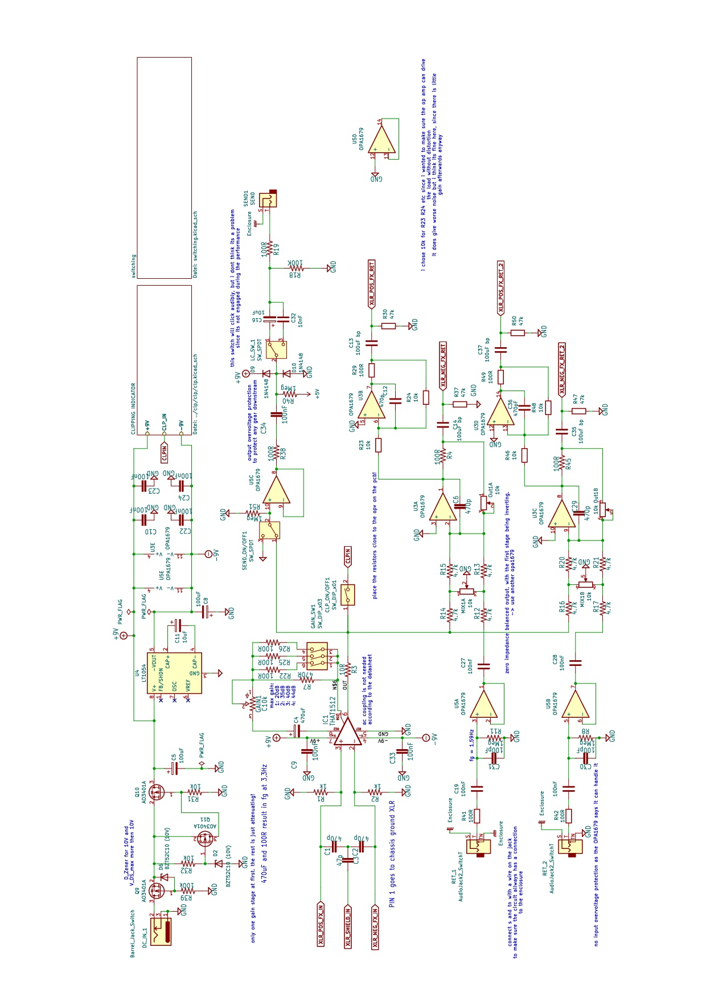
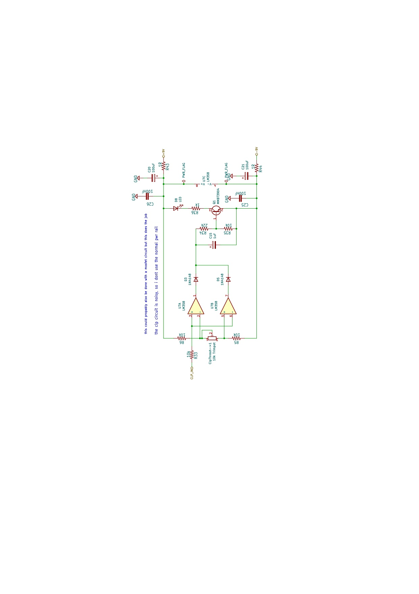
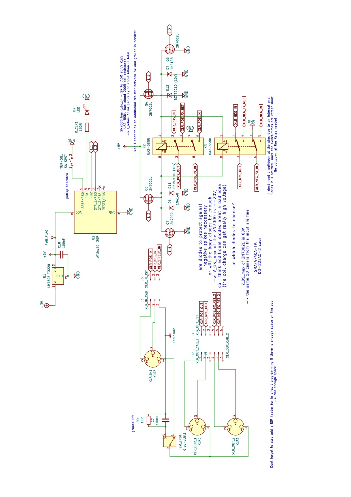
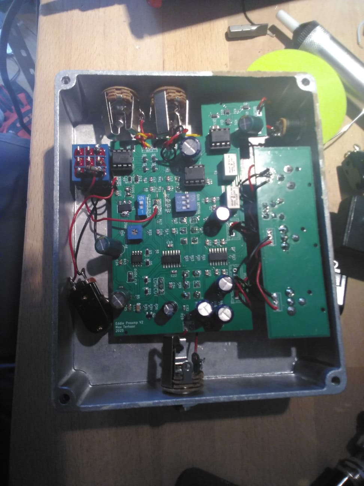

# 9V Stereo Return Microphone Preamplifier
*A simple microphone preamplifier in the standard guitar pedal format designed for live usage.*

## Overview
This circuit is a **microphone preamplifier** designed to make dynamic microphones compatible with **guitar pedals**. It provides sufficient gain to raise microphone-level signals to typical pedal operating levels while maintaining low-noise performance.

Because the unit is intended for live use, 48 V phantom power is not included. Aadding it would have required a more sophisticaed power section and power supply differing from the standard 9V DC used with other effect pedals. Since this was my first time working with a microcontroller and programming in c I closely followed this tutorial (https://www.amplifiedparts.com/tech-articles/relay-true-bypass-switching-3) for controlling the relais.

## Features

### Signal Path
- **Balanced XLR input** (Neutrik **NC3FBH1**)
- **6.3 mm send**
- **Stereo 6.3 mm returns**
- **Balanced stereo XLR outputs** (Neutrik **NC3MAH-S**)

### Gain and Indication
- **Clipping indicator LED**, threshold adjustable via onboard trimmer
- **3-position DIP switch** to select the maximum gain
  - Enables precise gain control for different sources (e.g., vocals, trumpet) while keeping the front panel uncluttered

### Some grounding considerations
- Input XLR **pin 1** is bonded directly to the chassis via Neutrik NC3FBH1
- Output XLR **pin 1** routed to a PCB ground plane (not directly to chassis), implementing a serial star-ground topology
- **Ground-lift switch** allows lifting output ground while maintaining a solid chassis bond at the input

### Filtering and Switching
- **Selectable low-cut filter** on the send (to reduce, for example, vocal low-frequency in order to prevent a muddy effects signal)
- **Send On/Off** footswitch (in hindsight i shouldve added another led for this switch)
- **True bypass** footswitch with LED indicator

### Control Logic
- Switching via **two small-signal relays** driven by an **H-bridge** and an **ATtiny85**

### Front-Panel Controls
- **Gain** — microphone preamplifier gain
- **Dry/Wet Mix** — blend of direct and return signals
- **Output Volume** — final output level for live dynamics control

## Schematics

### Main Preamplifier

### Clipping Indicator

### MCU Switching

## Buildnotes

### View of the PCB

## Things to rework
As allways the first PCB had some mistakes (I forgot to add a pulldown resistor to the send switch, resulting in annoying clicking noises when engaged), but it worked for my purposes with a quick fix. However, if I were to redo it, I would use JST Connectors for connecting all the jacks and switches to the pcb,  this way they are a lot easier to repair in case something breaks. Doing this would also help make the manufacturing a bit quicker and easier. Additionally I would use threaded holes for mounting the xlr connectors, since tightening these nuts inside the cramped enclosure gave as little joy as one would expect. Lastly, another LED indicating if the Send is turned On or Off would have been a good idea.

